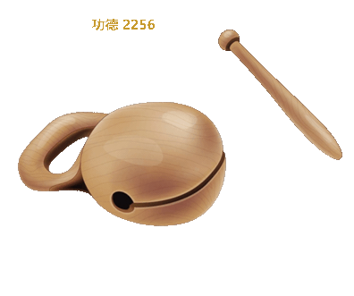

# Windows 桌面电子木鱼 🪵🐟

> 敲击赛博木鱼，积攒数字功德。一个**纯 Win32 API** 实现的桌面挂件：单 exe、零依赖、真透明、带声音。

<sub>没有 Electron，没有 Qt，没有解释器——只有一个约 57 MB 的 `电子木鱼.exe`（6 首内置完整禅曲占绝对大头，程序本体仅约 1 MB），双击即用。</sub>

## 🎞️ 效果演示

自动敲击（慢档）实录 8 秒：



## ✨ 特性

- 🖱️ **点谁敲谁**：整窗即按钮，**松手一刻**木槌才绕柄急落下挥（按住移动则是拖窗，不会误敲），**触鱼一刻**才发声、鱼身受压缩放、音波纹扩散——先敲后响，手感真实
- 🔢 **功德计数**：总功德 + 今日功德，跨天自动清零，重启不丢（注册表持久化）
- 📒 **功德簿**：自动记下每天最终功德，菜单一键翻阅历史清单与累计
- 🔥 **连击系统**：1.5 秒内连击计 combo，音调逐级升高，10/30/50 连击触发金色"连击"暴击飘字
- 📜 **飘字文案**：固定"功德 +1"、随机福语 20 条（佛系/智慧/慈悲/欢喜/福报/福慧/放下/豁达/无畏/善巧……）或关闭
- ⏰ **自动敲击**：慢/中/快三档挂机，电子木鱼替你先敲为敬
- ⌨️ **全局热键**：任意界面按 <kbd>F8</kbd> 隔空敲一记
- 🎯 **今日目标**：27 / 54 / 108 / 216 四档佛教数字或任意自定义，进度条实时推进；达成后计数隐去，金色佛光 +"功德圆满"呼吸
- 🎨 **四皮肤**：原木 / 鎏金 / 水墨 / 霓虹，同一素材 ColorMatrix 实时调色
- 🎵 **真·音效**：Media Foundation 预解码 + XAudio2 多声部混音，连打声浪自然重叠
- 🧘 **禅定背景音**：6 首内置完整曲目（含《大悲咒》印能法师版；5 首 Kevin MacLeod, CC-BY 4.0）或自选本地音频（mp3/wav/m4a/aac/flac/wma），整曲一次解完后才起播、播放期间零解码永不卡顿，无缝循环，与敲击共用音量档
- 🌙 **睡眠定时**：禅定音可设 15/30/45/60/90 分钟定时，到点 5 秒缓缓淡出自动停止——打坐睡着了也不扰人
- ℹ️ **关于页**：版本 v1.2.0（单一来源 `resources/version.h`，与 exe 文件属性一致）、素材致谢、战绩一览
- 📌 **窗口特性**：逐像素真透明不规则窗口、置顶开关、拖拽移动、"固定"开关（勾选后防误碰移位）、启动固定屏幕右下角、系统托盘（双击显隐）、开机自启
- 📐 **三档尺寸**：小 / 中 / 大（大 = 素材原始 480px 满幅）

## 🚀 快速开始

### 直接运行（Windows 10/11 x64）

从 Releases 下载 `wooden_fish.exe`（GitHub 附件不支持中文名，程序即电子木鱼），双击即可。无需安装，无需任何运行库。

### 自行构建

```powershell
# 需要 Visual Studio 2022（MSVC）+ CMake
cmake -B build_msvc -G "Visual Studio 17 2022" -A x64
cmake --build build_msvc --config Release
# 产物：build/电子木鱼.exe
```

## 🧱 技术架构

纯 Win32 + GDI+ 单线程应用，素材与音频全部嵌入 exe（RCDATA）。按企业级分层组织，依赖严格单向：

```
ui (窗口/菜单) → render (绘制/皮肤) → media (图像/音频) → core (状态/设置) → config (常量)
```

| 层 | 模块 |
|---|---|
| 入口 | `main.cpp` `app_context.h` |
| 配置 | `config/layout.h` |
| 核心 | `core/util` `core/app_state` `core/settings` `core/autorun` |
| 媒体 | `media/assets` `media/audio_engine` |
| 渲染 | `render/painter` `render/skins` |
| UI | `ui/main_window` `ui/menu` `ui/prompt` |

**关键技术点**

- 分层窗口 `UpdateLayeredWindow`：每帧渲染到 32bpp 预乘 alpha DIB，实现无边框真透明
- 按需渲染：16ms 动画定时器只在有动画时挂载，静止自动摘除——空闲后台 CPU 占用 ≈ 0
- Per-Monitor v2 DPI：画面随所在显示器实际缩放比自动适配，跨屏拖动不模糊
- 启动门控：敲击音在显示窗口前解码为 PCM 常驻（首击零延迟）；禅曲选中时才后台线程整曲解码、解完才起播，内存只驻留当前一首的 PCM，换曲即释放
- 连击变调：`IXAudio2SourceVoice::SetFrequencyRatio`，每连击 +0.4%（封顶 50）
- 状态持久化：`HKCU\Software\WoodenFish`，容量 8 字节的功德计数器 🗃️

详细文档：

| 文档 | 内容 |
|---|---|
| [系统架构](docs/architecture.md) | 分层设计、技术选型与理由、数据流、线程模型 |
| [类图](docs/class-diagram.md) | 全模块 Mermaid 类图与关键类型说明 |
| [时序图](docs/sequence-diagrams.md) | 启动/敲击/定时器/菜单/退出五条链路 |
| [开发指南](docs/development-guide.md) | 构建、约定、注册表格式、踩坑记录、扩展方法 |

## ⌨️ 操作一览

| 操作 | 效果 |
|---|---|
| 左键单击木鱼 | 抬起时敲击 +1 功德（按住移动 = 移动窗口且不算敲击，菜单勾选"固定"后禁用拖动） |
| 右键 / 托盘单击 | 弹出菜单（大小/音量/自动/目标/皮肤/禅定音/睡眠定时/功德簿/置顶/固定/自启/关于…） |
| 托盘双击 | 显示 / 隐藏木鱼 |
| <kbd>F8</kbd> | 全局热键，隔空敲击 |

## 🙏 致谢与素材来源

- 视觉布局参考开源微信小程序「电子木鱼」(mp-muyu) 的 rpx 版式，素材为项目内 PNG
- 达成佛光贴图（放射光线、带真实透明通道）为本地 AI 生成，无版权负担
- 禅定背景音：6 首可切换完整曲目（*Meditation Impromptu 01*、*Fresh Air*、*Kalimba Relaxation Music*、*River Flute*、*White Lotus*）— 均为 [Kevin MacLeod](https://incompetech.com), CC-BY 4.0；*大悲咒（印能法师版）* — 佛音网 (foyinwang.com) 免费流通版本（授权未明，请勿商用）
- 功德无价，本软件亦免费

## 📄 License

素材音乐遵循 CC-BY 4.0 署名要求；代码部分暂未声明许可证（拟用 MIT，待定）。
