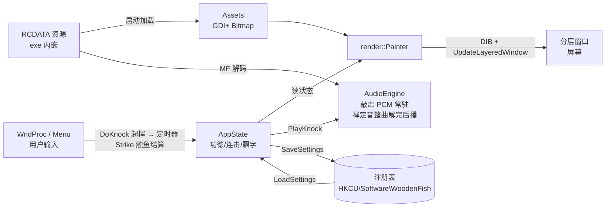

# 系统架构

> 电子木鱼（木鱼）—— 纯 Win32 API 桌面小工具，单 exe 零依赖。

## 1. 设计目标

| 目标 | 落地方式 |
|---|---|
| 零部署依赖 | 只用 Windows 自带系统 DLL（GDI+ / MF / XAudio2 / Shell），不引入任何框架 |
| 单文件分发 | 图片、音效、图标、版本信息全部以 `RCDATA`/`ICON`/`VERSIONINFO` 嵌入 exe |
| 首击零延迟 | 启动时把敲击 mp3 预解码为 PCM 常驻内存，播放路径上不再有解码开销（禅定音同理：整曲解完后才起播，见 4.2） |
| 真透明窗口 | 分层窗口 + `UpdateLayeredWindow` 逐像素 alpha，无矩形边框 |
| 可维护性 | 企业式分层：常量配置 / 核心状态 / 媒体 / 渲染 / UI 五层单向依赖 |

## 2. 分层结构

```
┌─────────────────────────────────────────────┐
│  入口  src/main.cpp (wWinMain 生命周期编排)   │
├─────────────────────────────────────────────┤
│  UI 层  src/ui/                             │
│    main_window  窗口/托盘/消息编排/敲击动作    │
│    menu         右键与托盘菜单构建与分发       │
├─────────────────────────────────────────────┤
│  渲染层  src/render/                         │
│    painter   整帧绘制 → DIB → 分层窗口贴回     │
│    skins     GDI+ ColorMatrix 皮肤调色        │
├─────────────────────────────────────────────┤
│  媒体层  src/media/                          │
│    assets        RCDATA → GDI+ Bitmap        │
│    audio_engine  MF 解码 + XAudio2 混音       │
├─────────────────────────────────────────────┤
│  核心层  src/core/                           │
│    app_state  全部可变运行时状态(无 Win32 副作用)│
│    settings   注册表持久化                    │
│    autorun    开机自启(HKCU Run 键)           │
│    util       编码转换/日期/缓动              │
├─────────────────────────────────────────────┤
│  配置层  src/config/layout.h                 │
│    几何/时间轴/档位表/文案表，全部编译期常量     │
└─────────────────────────────────────────────┘
```

**依赖规则（严格单向）**：`ui → render → media → core → config`。
下层不知道上层存在；`config` 不依赖任何自定义模块。跨层传递的唯一聚合对象是 `AppContext`（定义于 `src/app_context.h`），由 `main.cpp` 构造，经 `GWLP_USERDATA` 挂到窗口句柄上供 `WndProc` 取回。

## 3. 模块职责一览

| 文件 | 职责 | 关键点 |
|---|---|---|
| `src/main.cpp` | 进程生命周期 | GDI+/COM/MF 启停顺序、消息循环、退出清理次序严格对称 |
| `src/app_context.h` | 依赖聚合 | `AppState + Assets + AudioEngine + HWND + 托盘数据` |
| `src/config/layout.h` | 静态配置 | 鱼/槌几何、动画时长、尺寸档、音量档、目标档、福语表 |
| `src/core/app_state.h` | 可变状态 | 功德/连击/飘字列表/拖动瞬态，全部字段可序列化或被重置 |
| `src/core/settings.*` | 持久化 | `HKCU\Software\WoodenFish`，merit/daily 用 REG_BINARY，其余 DWORD |
| `src/core/autorun.*` | 开机自启 | `HKCU\...\Run\WoodenFish` 值存在与否即勾选态 |
| `src/core/util.*` | 工具 | UTF-8→wstring、`TodayYmd()` 日切、缓动函数 |
| `src/media/assets.*` | 图像素材 | `FindResource → SHCreateMemStream → Gdiplus::Bitmap::FromStream` |
| `src/media/audio_engine.*` | 音频 | MF SourceReader 解码 16bit PCM；XAudio2 每击一声部、音调随连击升高、按时间回收；禅定音由独立解码线程整曲解完后才起播（XAudio2 引擎线程播放，两线程分离），换曲即释放旧曲 PCM |
| `src/render/skins.*` | 皮肤 | 4 组 ColorMatrix，按 skinIdx 缓存 ImageAttributes |
| `src/render/painter.*` | 渲染 | 32bpp premultiplied DIB 上画鱼身挤压、波纹、挥槌、飘字、功德、目标进度条（达成后改画"功德圆满"+佛光） |
| `src/ui/main_window.*` | 窗口 | 分层窗口、点击敲击、拖动移位、托盘回调、四定时器（动画帧按需挂载/自动敲击/睡眠倒计时/淡出步进）、F8 热键、WM_DPICHANGED |
| `src/ui/menu.*` | 菜单 | 纯文字 `MF_STRING` + `MF_CHECKED`，命令分发到各子系统 |
| `src/ui/prompt.*` | 小对话框 | 内存 DLGTEMPLATE + `DialogBoxIndirectParamW`：数字输入（自定义目标）、只读多行文本（功德簿/关于） |

## 4. 关键技术选型与理由

### 4.1 窗口：`UpdateLayeredWindow` 而非 `SetLayeredWindowAttributes`
逐像素 alpha 才能做出完全贴合素材轮廓的不规则透明；每帧画进 top-down 32bpp DIB（预乘 alpha），一次性贴出，无闪烁。
窗口样式：`WS_EX_LAYERED | WS_EX_TOPMOST | WS_EX_TOOLWINDOW` + `WS_POPUP`（不出现在任务栏，工具窗口样式）。

### 4.2 音频：Media Foundation + XAudio2（弃用 MCI/winmm）
- 本机环境的 MCI 设备链不可靠，`PlaySound`/`mciSendString` 均有延迟或失败问题。
- MF `IMFSourceReader` 解码 mp3 → PCM；敲击音短样本一次解码常驻内存，保证首击零延迟。
- XAudio2 原生多声部：快速连击时每次 `CreateSourceVoice` 提交独立缓冲，重叠播放自然形成"连打"效果；`SetFrequencyRatio` 让音调随连击升高（+0.4%/击，封顶 50）。
- 声部回收按 `播放时刻 + 样本时长 + 300ms` 推算，不依赖 `IsStopped` 轮询。
- 禅定背景音：6 首内嵌 mp3（IDR_ZEN1..6，全部为完整版不裁切；ZEN6 为《大悲咒》印能法师版，来源佛音网）+ 本地文件曲。**整曲解码后播放**：`ApplyZen` 在主线程先建 SourceReader（坏文件当场返回 false），随即起独立解码线程一次性把全曲解成 PCM（每个样本块轮询停止事件，可中途放弃），解完才建 SourceVoice 以 `XAUDIO2_LOOP_INFINITE` 起播——播放推进由 XAudio2 引擎线程完成，与解码线程分离，播放期间零解码开销、永不卡顿。内存与曲长成正比（34 分钟曲 ≈ 365MB）。换曲/关闭时 `StopZenStream` 停线程→毁声部→立即释放上一曲整曲 PCM。本地文件解完后代码内整曲首尾 1.5s 淡入淡出，循环两头皆静音。增益 0.45 × 音量档系数 × 淡出系数，实时改不中断循环。
- 禅定音睡眠定时：菜单选 15/30/45/60/90 分钟（会话级、不落盘），到点由 100ms UI 定时器把淡出系数从 1 逐档降到 0（5 秒），然后 `ApplyZen(0)` 停机并落盘 zen=0；期间手动切曲/改档即作废淡出（`ApplyZen` 复位系数）。

### 4.3 皮肤：ColorMatrix 调色而非多套素材
同一张位图用 `ImageAttributes + ColorMatrix` 实时变换（sepia 鎏金 / 去色偏冷水墨 / 通道重排霓虹），零额外体积。

### 4.4 文本渲染：GDI+ + Microsoft YaHei UI
与图形共用同一 Graphics 上下文，随 DIB 一起获得抗锯齿与 alpha 合成；小窗口时字号按"最小物理像素"反向放大（功德 ≥13px、目标 ≥11px 物理高），防止缩到不可读。

### 4.5 构建：CMake + MSVC
`/utf-8` 统一源字符集与执行字符集；`resources/app.rc` 首部 `#pragma code_page(65001)`。
注意：**不能定义 `WIN32_LEAN_AND_MEAN`**——MSVC 的 `gdiplus.h` 依赖完整 `windows.h` 引入的 COM/属性系统头（`IStream`、`PROPID`）。

### 4.6 DPI：Per-Monitor v2
启动最前动态加载 `SetProcessDpiAwarenessContext(PER_MONITOR_AWARE_V2)`（Win10 1703+，取不到导出或失败即退回 `SetProcessDPIAware()`）。
基准几何恒按 96dpi 定义；物理尺寸 = 基准 × `EffScale()`（档位系数 × 显示器 DPI 系数）。建窗后用 `GetDpiForWindow` 校正为所在显示器的真实 DPI（初始按系统 DPI 建），运行期响应 `WM_DPICHANGED` 按系统建议矩形重设——跨屏拖动、改系统缩放都不模糊，物理大小保持一致。

## 5. 数据流总览



## 6. 线程模型

单 UI 线程 + 一个只在解码期间存活的禅定解码线程。音频解码、位图加载全部在 `wWinMain` 显示窗口**之前**同步完成（门控），运行期不做任何磁盘/注册表扫描（仅敲击/改设置时一次性注册表写）。动画 16ms 定时器**按需挂载**：`SyncAnim` 在敲击/达成等动画需求出现时起表，最后一帧画完静止即自行摘除——空闲时零定时器唤醒，CPU 占用趋近 0。自动敲击、睡眠倒计时、淡出步进三个低频定时器同在 UI 线程 `WM_TIMER` 分发。

---

下一篇：[类图](class-diagram.md) · [时序图](sequence-diagrams.md) · [开发指南](development-guide.md)
