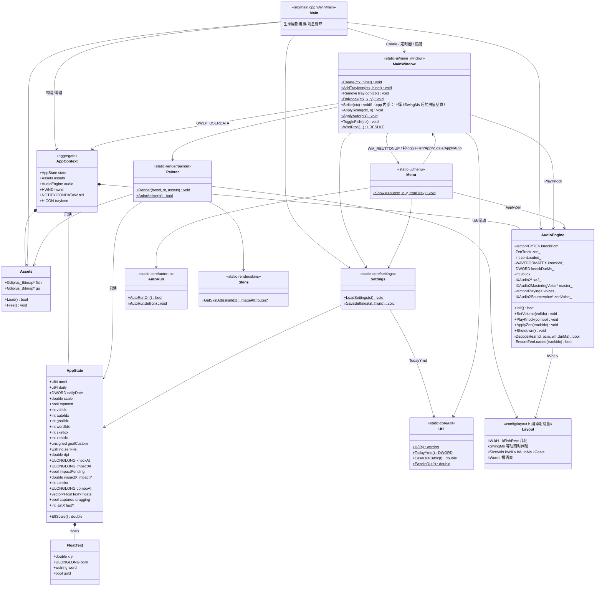

# 类图

> 项目以自由函数 + 轻量 struct 为主，下图将各命名空间中的类型与"工具模块"（以 `<<static>>` 表示的自由函数集合）统一按类呈现。

## 1. 总览类图

## 2. 分层命名空间

| C++ 命名空间 | 目录 | 内容 |
|---|---|---|
| `muyu` | `src/core`、根 | `AppState` `FloatText` `AppContext`、util/settings/autorun 自由函数 |
| `muyu::config` | `src/config` | 全部 `inline constexpr` 常量 |
| `muyu::media` | `src/media` | `Assets` `AudioEngine` |
| `muyu::render` | `src/render` | `Render` `AnimActive` `GetSkinAttr` |
| `muyu::ui` | `src/ui` | 窗口/菜单函数、`WndProc`、消息与定时器常量 |

## 3. 关键类型说明

### `AppState`（唯一的可变状态容器）
- **持久字段**：`merit daily dailyDate scale topmost volIdx autoIdx goalIdx goalCustom wordIdx skinIdx zenIdx zenFile` —— 与注册表一一对应，`Settings` 负责搬运。
- **瞬态字段**：`dpi knockAt impactAt impactPending impactX impactY combo comboAt floats captured dragging lastX lastY` —— 仅影响动画，不落盘（`dpi` 每次启动重算）。`knockAt` 是棒槌起挥时刻，声音/挤压/波纹/飘字以 `impactAt`（触鱼）为时基。
- `EffScale() = scale × dpi`：所有"基准坐标 ↔ 物理像素"换算的唯一入口。
- 渲染层只持有 `const AppState&`，写状态的路径只有 UI 层（敲击/菜单）和 `Settings::LoadSettings`。

### `AudioEngine`（RAII 风格但显式 Shutdown）
- `Init()`：仅解码敲击音（失败即整体失败）→ 创建 XAudio2 设备与 MasteringVoice。禅定曲目在 `ApplyZen` 选中时才懒解码。
- `SetVolume(volIdx)`：记录音量档；对禅定音用现有声部实时 `SetVolume`（0.45×档位系数），循环不中断、不从零重播。
- `PlayKnock(combo)`：先回收到期声部，再建瞬时声部（增益取当前音量档）；`endAt = now + 样本时长 + 300ms`。
- `ApplyZen(trackIdx)`：0=关（释放 PCM）；1..5 选曲，`EnsureZenLoaded` 按需解码且只常驻当前曲目，销毁并重建循环声部；幂等。
- `Shutdown()`：Zen 声部 → 敲击声部池 → Mastering → 设备，逆序释放。

### `AppContext`
纯数据结构（无行为），是"这个应用实例"的根对象。单实例设计，因此 `WndProc` 里经 `WM_NCCREATE` 的 `CREATESTRUCTW::lpCreateParams` 保存一次 `GWLP_USERDATA` 即可全程取回，避免全局变量。

---

上一篇：[架构](architecture.md) · 下一篇：[时序图](sequence-diagrams.md)
