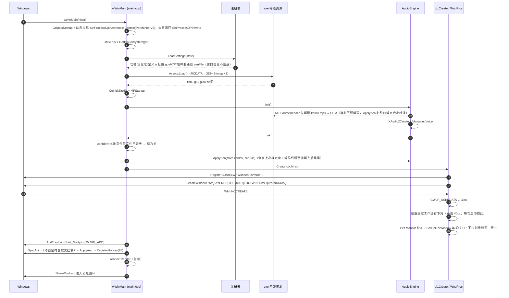
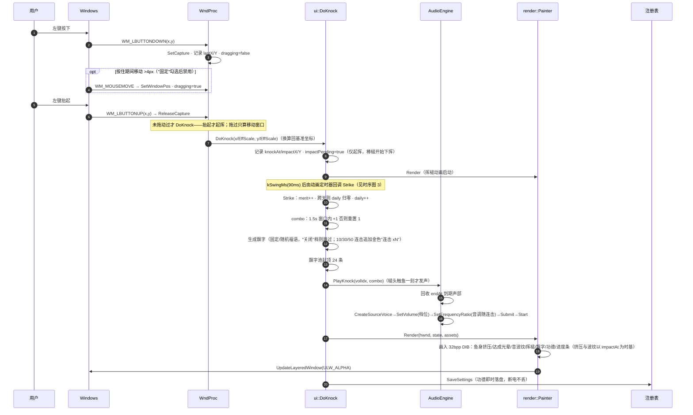
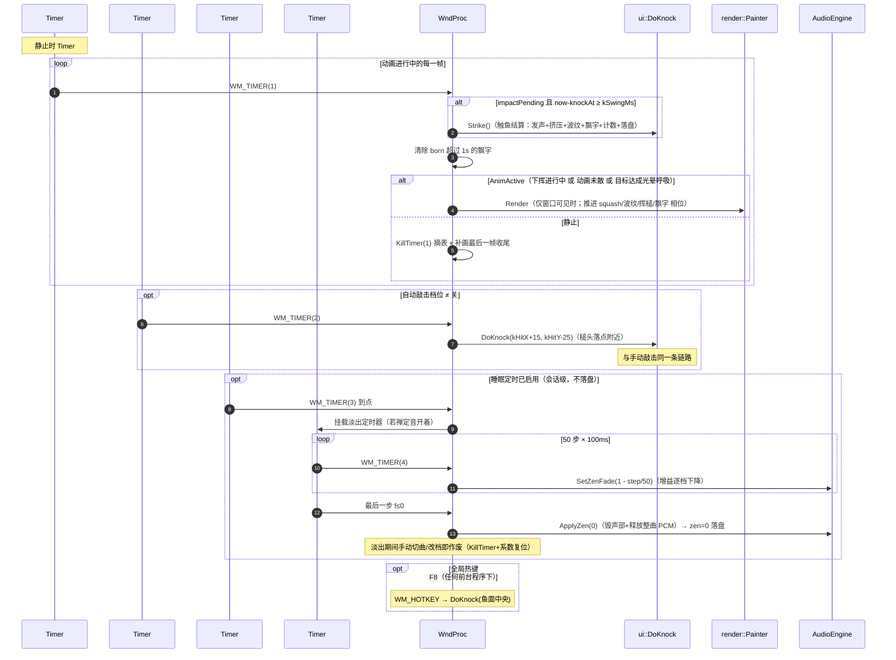
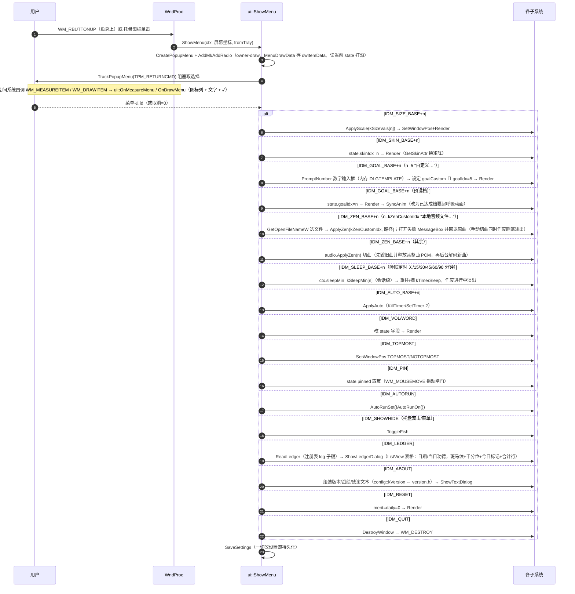
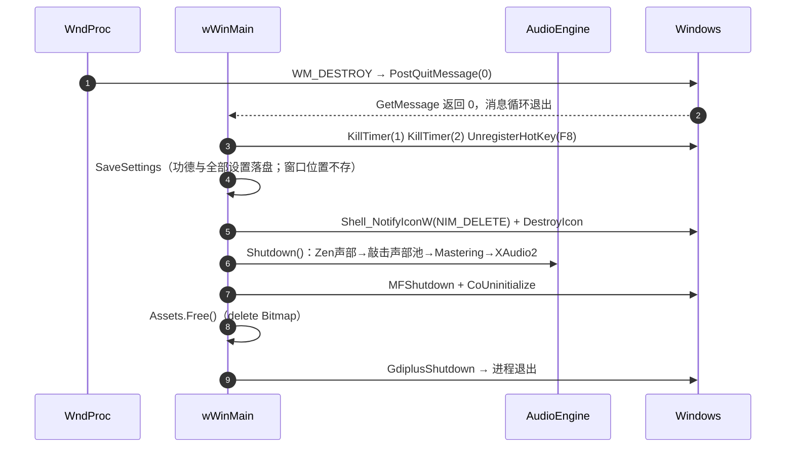

# 时序图

覆盖五条主链路：启动、手动敲击、动画/自动敲击循环、菜单操作、退出清理。

## 1. 启动序列（门控式：一切就绪才显示 UI）

> 解码先于窗口显示，保证第一次点击必有声音、无预热卡顿。

## 2. 手动敲击（一次点击的完整链路）

## 3. 定时器驱动：按需动画 / 自动敲击 / 睡眠淡出

## 4. 菜单操作（右键 / 托盘共用一套）

## 5. 退出与资源清理（与启动严格逆序）

---

上一篇：[类图](class-diagram.md) · 下一篇：[开发指南](development-guide.md)
